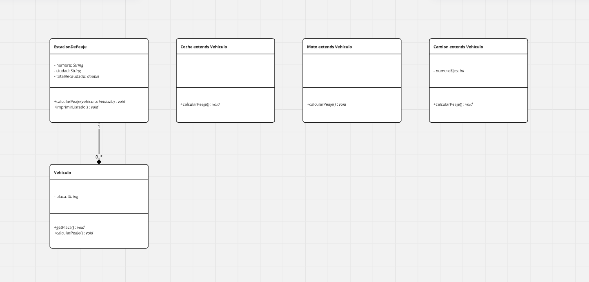

# Toll System Project

This project simulates a toll system for vehicles passing through a toll station. The system calculates the toll fee based on the vehicle type and generates a report listing the vehicles that passed through the station along with the total collected toll amount.

## Project Description

The system consists of a toll station (`TollStation`) that receives different types of vehicles. Each vehicle has a specific toll fee:
- **Car**: $100
- **Motorcycle**: $50
- **Truck**: $50 per axle

The system calculates the total toll collected and prints a report showing the vehicles that passed and their respective toll charges.

## Class Structure

Below is the UML diagram for the classes used in the project:

### Main Classes

1. **TollStation**:
    - Manages information about the toll station, vehicles, and total toll collected.
    - Contains the `addVehicle()` method to add vehicles and calculate the corresponding toll.
    - Prints a report of the vehicles and the total collected toll using the `printReport()` method.

2. **Vehicle** (abstract class):
    - Base class for all vehicle types.
    - Defines the abstract `calculateToll()` method, which must be implemented by subclasses to calculate the toll.

3. **Car**:
    - Represents a car. Its toll is fixed at $100.

4. **Motorcycle**:
    - Represents a motorcycle. Its toll is fixed at $50.

5. **Truck**:
    - Represents a truck. Its toll depends on the number of axles of the truck (charge of $50 per axle).

### Unit Tests

The project includes unit tests to ensure that the toll calculations and total collected toll are correct. **JUnit 5** is used for the unit tests. These tests validate:
- Toll calculation for cars, motorcycles, and trucks.
- Total toll collection calculation.
- Report printing with vehicles and their respective toll charges.

### Requirements

- **Java 11 or higher**
- **JUnit 5** for unit testing

